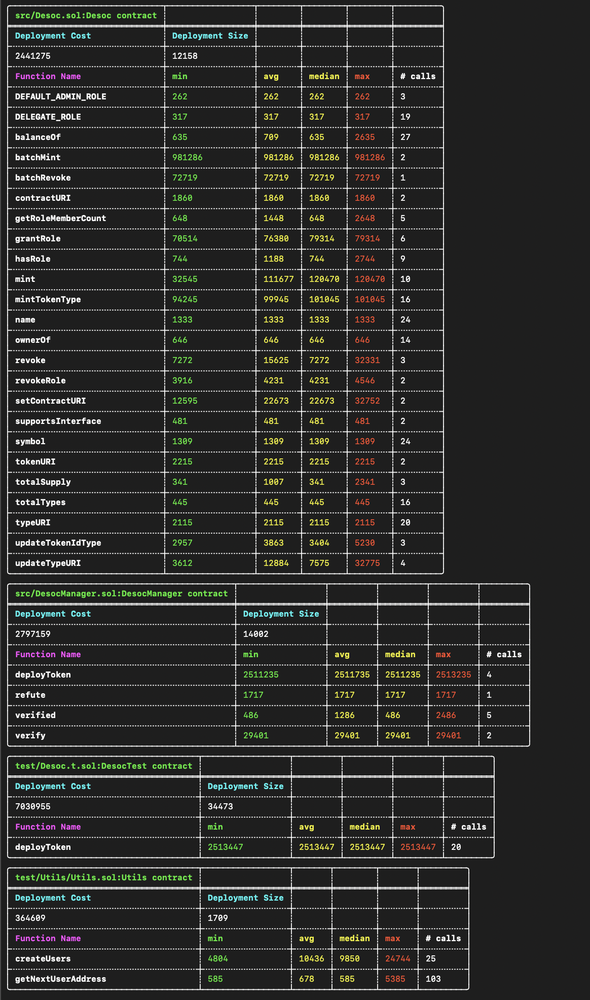

## Desoc Contracts

[](https://github.com/desci-labs/soulbound/actions/workflows/contracts.yml)

This repository contains the core smart contracts for the DeSoc OSS collective.

### setup
Install [foundry](https://book.getfoundry.sh/getting-started/installation) locally
```bash
cd apps/contracts
yarn install
yarn remapping-transform # generates foundry import remappings
```

**Note:** duplicate the .env.example file and rename to .env, update the env variables specified
### Local deployment
```bash
# start local foundry node
Anvil

# run deploy script
yarn deploy
```
### Testing
Test both gasless and regular flows
```bash
yarn test
```
# Gas report snaphots

